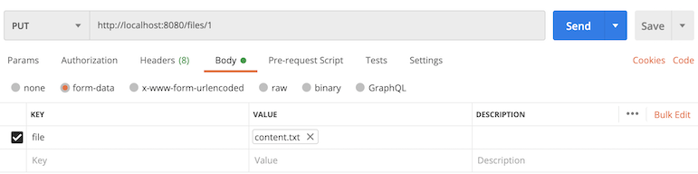

# Getting Started with Spring Content REST

## What you'll build

You'll remove redundant code from the document list web application that
we produced in our first [Getting Started Guide](spring-content-fs-docs.md).

## What you'll need

- About 30 minutes

- A favorite text editor or IDE

- JDK 1.8 or later

- Maven 3.0+

## How to complete this guide

Before we begin let's set up our development environment:

- Download and unzip the source repository for this guide, or clone it
using Git: `git clone https://github.com/paulcwarren/spring-content-gettingstarted.git`

- We are going to start form where we left of in the last Getting Started
Guide so `cd` into `spring-content-gettingstarted/spring-content-fs/complete`

- Move ahead to `Update dependencies`.

When you’re finished, you can check your results against the code in
`spring-content-gettingstarted/spring-content-rest/complete`.

### Update dependencies

Add the `com.github.paulcwarren:spring-content-rest-boot-starter` dependency.

`pom.xml`

```
{snippet: https://raw.githubusercontent.com/paulcwarren/spring-content-gettingstarted/master/spring-content-rest/complete/pom.xml 1-}
```

## Update File Entity

Add the `@MimeType` marker annotation to our Entity.

`src/main/java/gettingstarted/File.java`

```
{snippet: https://raw.githubusercontent.com/paulcwarren/spring-content-gettingstarted/master/spring-content-rest/complete/src/main/java/gettingstarted/File.java 1-}
```

The `mimeType` attribute is updated with the Spring Content  `@MimeType`
annotation so that Spring Content REST will update its value on our behalf.

## Update FileContentStore

So that we can perform simple CRUD operations, over a hypermedia-based
API, update our `FileContentStore` by annotating it with the
`@StoreRestResource` Spring Content REST annotation.

`src/main/java/gettingstarted/FileContentStore.java`

```
{snippet: https://raw.githubusercontent.com/paulcwarren/spring-content-gettingstarted/master/spring-content-rest/complete/src/main/java/gettingstarted/FileContentStore.java 1-}
```

## Remove FileContentController

Having made the above updates we can remove our `FileContentController`
as it is now surplus to requirements.   Spring Content REST will provide
these endpoints for us.

## Build an executable JAR

If you are using Maven, you can run the application using `mvn spring-boot:run`.
Or you can build the JAR file with `mvn clean package` and run the JAR
by typing:

`java -jar target/gettingstarted-spring-content-rest-0.0.1.jar`

## Test the application

And then point your browser at:-

`http://localhost:8080`

and you should see something like this:-

<center></center>

As you did in the previous tutorial, exercise the application by uploading
a range of new files and viewing them.  You should see viewed files open
as they did before.

## Test the REST API

Alternatively, you can test the REST API directly.

First create an entity:

`curl -X POST -H 'Content-Type:application/hal+json' -d '{}' http://localhost:8080/files/`

You should recieve a response back from your service that looks something like the following:

```
{
  "name" : null,
  "created" : "2020-10-20T04:17:03.733+0000",
  "summary" : null,
  "contentId" : null,
  "contentLength" : 0,
  "mimeType" : "text/plain",
  "_links" : {
    "self" : {
      "href" : "http://localhost:8080/files/1"
    },
    "file" : {
      "href" : "http://localhost:8080/files/1"
    },
    "content" : {
      "href" : "http://localhost:8080/files/1"
    }
  }
}
``` 

Follow the `content` link relation to add content either using CURL:

`curl -X PUT -H 'Content-Type:text/plain' -d 'Hello Spring Content World!' http://localhost:8080/files/1` 

Or, if you prefer, by uploading the content via postman:

<center></center>

---
**NOTE**

Unlike the curl-based PUT example above this Postman request is specifying a `multipart/form-data` request and a form entry with a key of `file` and with the content of the file as the value.

Spring Content REST supports PUT and POST requests with the Content-Type header set to the actual mimetype of the content, such as `text/plain` or with a content-type of `multipart/form-data` and a properly constructed multipart form. 

---

Lasty, verify the content was uploaded by requesting it again:

`curl -H 'Accept:text/plain' http://localhost:8080/files/1`

You should see you content returned as follows:

`Hello Spring Content World!`

## Summary

Congratulations!  You've written a simple application that uses Spring
Content and Spring Content REST to save objects with content to the
file-system and to fetch them again using a hypermedia-based REST API -
all without writing any implementation code to handle file access.

Don't forget you can simply change the type of the spring-content bootstarter
project on the classpath to switch from file storage to a different
storage medium.  Spring Content REST works seamlessly with all of the storage modules.

Spring Content supports the following implementations:-

- Spring Content Filesystem; stores content as Files on the Filesystem
(as used in this tutorial)

- Spring Content S3; stores content as Objects in Amazon S3

- Spring Content JPA; stores content as BLOBs in the database

- Spring Content MongoDB; stores content as Resources in Mongo's GridFS
