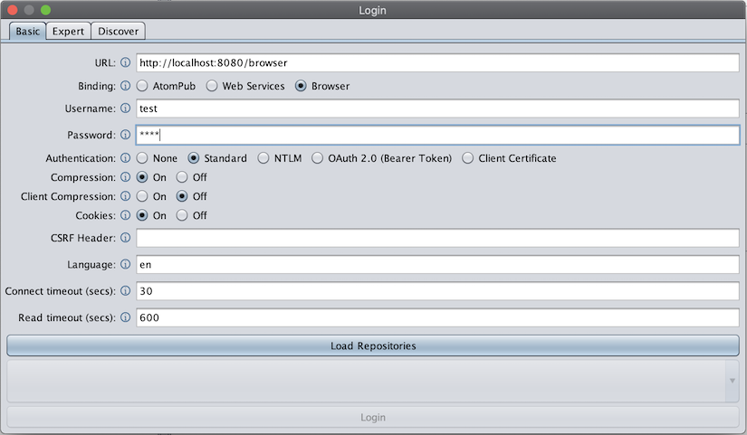
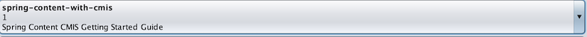
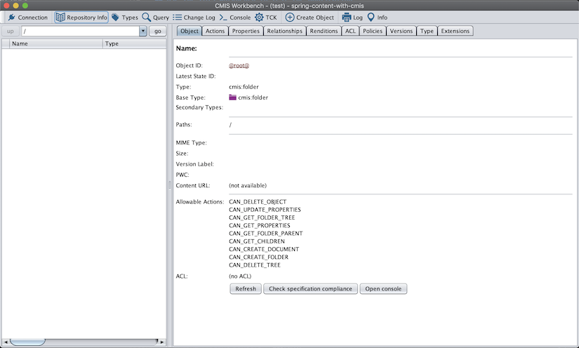
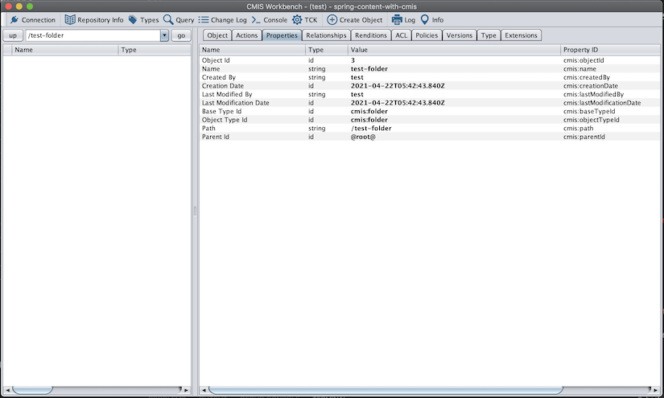
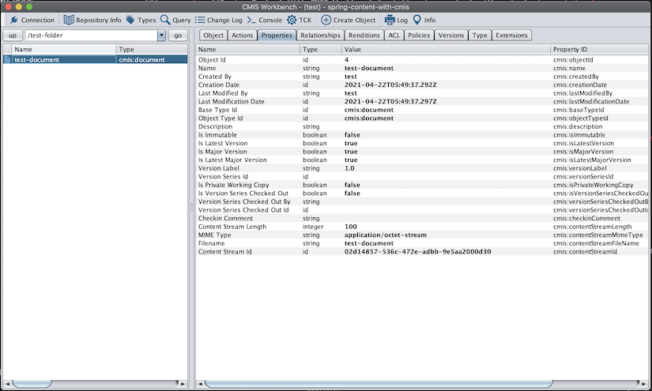
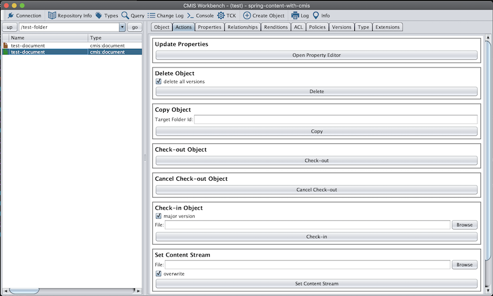

# Getting Started with Spring Content and CMIS (Spring Content 2.x only - Deprecated)

## What you'll build

You'll build a simple document management application using Spring Content and Spring Content CMIS.

## What you'll need

- About 30 minutes

- A favorite text editor or IDE

- JDK 1.8 or later

- Maven 3.0+

You can also import the code from this guide as well as view the web page directly into Spring Tool Suite (STS) and work your way through it from there.

## How to complete this guide

Like most Spring Getting Started guides, you can start form scratch and complete each step, or you can bypass basic setup steps that are already familiar to you.  Either way, you end up with working code.

To start from scratch, move on to Build with Maven.

To skip the basics, do the following:

- Download and unzip the source repository for this guide, or clone it using Git: `git clone https://github.com/paulcwarren/spring-content-gettingstarted.git`

- `cd` into `spring-content-gettingstarted/spring-content-with-cmis/initial`

- Jump ahead to `Define a simple entity`.
When you’re finished, you can check your results against the code in `spring-content-gettingstarted/spring-content-with-cmis/complete`.

## Build with Maven

First you set up a basic build script. You can use any build system you like when building apps with Spring, but the code you need to work with [Maven](https://maven.apache.org/) is included here.  If you’re not familiar with Maven, refer to [Building Java Projects with Maven](http://spring.io/guides/gs/maven).

### Create a directory structure

In a project directory of your choosing, create the following subdirectory structure; for example, with `mkdir -p src/main/java/gettingstarted` on *nix systems:

```
∟ src
   ∟ main
       ∟ java
           ∟ gettingstarted
       ∟ resources
           ∟ static
```

`pom.xml`

```
{snippet: https://raw.githubusercontent.com/paulcwarren/spring-content-gettingstarted/main/spring-content-with-cmis/complete/pom.xml 1-}
```

We add several dependencies:-

- Spring Boot Starter Web provides the web server framework

- Spring Security provides the security framework

- Spring Boot Starter Data JPA will provide a relational database to
store the metadata of our documents.  In this case we are using the H2
in-memory database

- Spring Boot Starter Content FS will provide Filesystem-based
storage for the content of each document and manage its association with a Document Entity

- Spring Versions JPA adds the ability to create new versions of a Document

- Spring Content CMIS provides the ability to export Document and Folder Entities via 
CMIS browser bindings.

## Create an Application class

We need to initialize various aspects of our application.  First we'll add the usual Spring Boot Application class.

`src/main/java/gettingstarted/SpringContentApplication.java`

```
{snippet: https://raw.githubusercontent.com/paulcwarren/spring-content-gettingstarted/main/spring-content-with-cmis/complete/src/main/java/gettingstarted/SpringContentApplication.java 1-}
```

Let's talk through the annotations:

- `@SpringBootApplication` needs no explanation

- `@EnableCmis` enables the cmis bindings.  The most important attribute is basePackages.  This tells the Spring Content CMIS 
module which packages to scan for Entities with `@Cmis` annotations.  We'll see these presently.

- `@Import` imports the Spring Versions JPA standard configuration

- `@EnableJpaRepositories` tells Spring Data which packages to scan for Spring Data JPA Entities.  We need to add this annotation 
in order to instruct Spring Data to scan the `org.springframework.versions` package (where it will find the `LockingAndVersioningRepository` fragment implementation) in addition to the `gettingstarted` package.

- `@EnableFilesystemStores` enables Spring Content Filesystem Storage.  Technically, this is not required but added for clarity.

You will also see that this application enables Spring Security setting up a single user `test` with a password of `test`.  As
well as entity auditing that we use to timestamp entity creation and modification. 

## Define a BaseObject

We are going to model both Documents and Folders and they share some common characteristics so let's define a BaseObject that 
they can both inherit from:

`src/main/java/gettingstarted/BaseObject.java`

```
{snippet: https://raw.githubusercontent.com/paulcwarren/spring-content-gettingstarted/main/spring-content-with-cmis/complete/src/main/java/gettingstarted/BaseObject.java 1-}
```

As you would expect we created a standard JPA Entity to capture some common metadata; `name` and `description`.  Standard audit 
metadata; `createdBy`, `createdDate`, `modifiedBy`, `modifiedDate`, and a revision stamp; `vstamp`.  Lastly, we create a many-to-one relationship to a parent folder.

You will notice that several of these fields are annotated with `@Cmis` annotations.  `@CmisName` and `@CmisDescription` map
these fields to their respective cmis fields.  `@CmisReference` is a special reference that instructs Spring Content CMIS 
that this is part of a parent/child relationship.  

## Create a Folder Entity

Next, we'll create the Folder entity.  As you would expect a Folder is a containing object allowing users to arrange their
documents hierarchically.

`src/main/java/gettingstarted/Folder.java`

```
{snippet: https://raw.githubusercontent.com/paulcwarren/spring-content-gettingstarted/main/spring-content-with-cmis/complete/src/main/java/gettingstarted/Folder.java 1-}
```

Note the `@CmisFolder` annotation that maps this entity to the cmis:folder object type.  Also note the `@CmisReference` annotation instructing Spring Content CMIS that this is the other end of the parent/child relationship.

## Create a Document entity

Lastly, we'll create the Document entity.  

`src/main/java/gettingstarted/Document.java`

```
{snippet: https://raw.githubusercontent.com/paulcwarren/spring-content-gettingstarted/main/spring-content-with-cmis/complete/src/main/java/gettingstarted/Document.java 1-}
```

Again, note the `@CmisDocument` that maps this entity to the cmis:document object type.  We also see the standard Spring Versions
JPA annotations for capturing version metadata as Documents are versioned.  

## Create Repositories and Storage

For both `Folder` and `Document` we create Repository interfaces:

```
public interface FolderRepository extends JpaRepository<Folder, Long> {
}

public interface DocumentRepository extends JpaRepository<Document, Long>, LockingAndVersioningRepository<Document, Long> {
}
```

The `DocumentRepository` extends `LockingAndVersioningRepository` making Documents versionable.

And, of course, we create a Storage interface for Documents:  

```
public interface DocumentStorage extends ContentStore<Document, UUID> {
```

## Build an executable JAR

That's it.  That's all you need.  So let's take our application for a spin. If you are using Maven, you can run the application using `mvn spring-boot:run`.  Or you can build the JAR file with `mvn clean package` and run the JAR by typing:

`java -jar target/gettingstarted-spring-content-with-cmis-0.0.1.jar`

## Use the CMIS Workbench to test the application

We'll use the CMIS Workbench from the Apache Chemistry project to test the application.

The workbench can be downloaded from [here](https://chemistry.apache.org/java/developing/tools/dev-tools-workbench.html).

Due to [this bug](https://issues.apache.org/jira/browse/CMIS-1062), Java 8 is required.

Download and run the workbench; i.e. `./workbench.sh`.  

Spring Content CMIS exports the CMIS browser bindings to the `/browser` endpoint therefore the URL is
`http://localhost:8080/browser` and the binding type is `Browser`.

The username and password, as per the `SecurityConfig`, is `test/test`.

<center></center>

Click `Load Repositores` and you should see this:

<center></center>

This information should match the information provided in the Application class.  

Click `Login` and you should see something like this:

<center></center>

Let's create a folder.  Click `Create Object` -> `Folder`.  Enter `test-folder` as the name and click `Create Folder`.

You'll see the folder in the navigation pane.  Double-click on the folder to navigate into it.  Select the `Properties` tab
to view its properties.

<center></center>

Now, let's create a Document in this Folder.  Click `Create Object` -> `Document`.  Enter `test-document` as the name and 
generate 100 bytes of content.  Click `Create Document`.

<center></center>

Let's take a look at its content.  Double-click on the document in the navigator to open the content in a new window.

Earlier we made our Entity's versionable by having our `DocumentRepository` extend `LockingAndVersioningRepository` so let's create a new version of this document.  Make sure the document is selected in the navigator.  Select the `Actions` tab and `Check-out Object`.  Now you should see two documents in your navigator.  One blue, the original.  One green, a private working copy of the new version.

<center></center>

Usually, a user would iterate on their content and save it by setting the content stream.  All of which is private to them.
For simplicity we'll skip this step and go straight to checking in.  In the `Check-in Object` panel select a local file and 
`Check-in`.

Investigate the properties of both versions to see how they are related.  You should see that they share the same version series
id and in fact one of them, the first we created, is that document.  Also note, the content streams IDs are different and when viewed you, in fact, do see different content.  

## Summary

Congratulations! You’ve written a simple application that uses Spring
Content CMIS.
