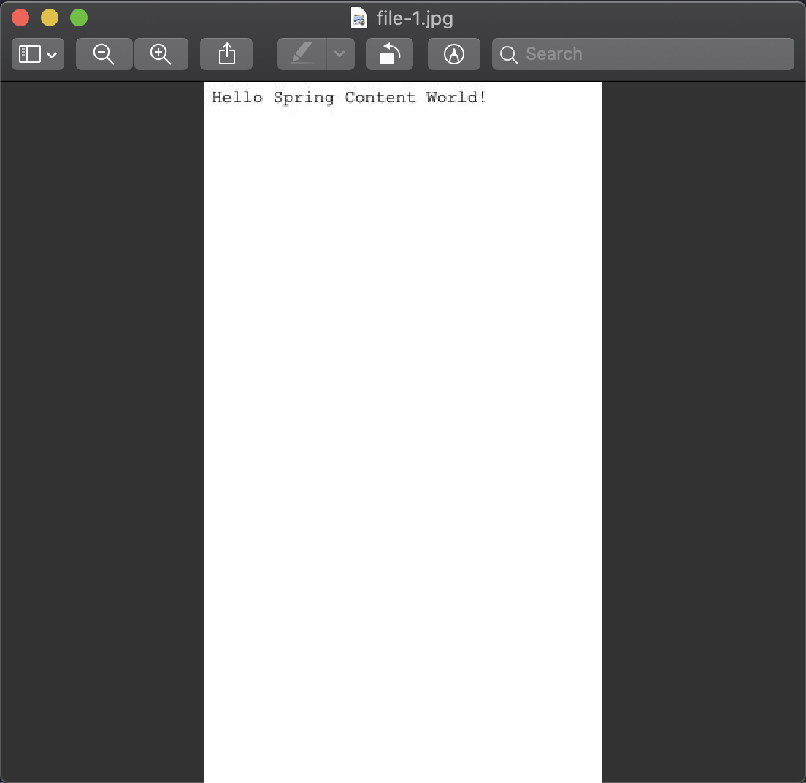

# Getting Started Spring Content with Fulltext

## What you'll build

We'll build on the previous guide [Getting Started with Spring Content REST API](spring-content-rest-docs.md).

## What you'll need

- About 30 minutes

- A favorite text editor or IDE

- JDK 1.8 or later

- Maven 3.0+

## How to complete this guide

Before we begin let's set up our development environment:

- Download and unzip the source repository for this guide, or clone it
using Git: `git clone https://github.com/paulcwarren/spring-content-gettingstarted.git`

- We are going to start where Getting Started with Spring Content REST API leaves off so
 `cd` into `spring-content-gettingstarted/spring-content-rest/complete`

When you’re finished, you can check your results against the code in
`spring-content-gettingstarted/spring-content-with-fulltext/complete`.

### Update dependencies

Add the `com.github.paulcwarren:spring-content-renditions-boot-starter` dependency.

`pom.xml`

```
{snippet: https://raw.githubusercontent.com/paulcwarren/spring-content-gettingstarted/master/spring-content-with-renditions/complete/pom.xml 1-}
```

## Update File

To be able to return renditions we need to know the mime-type of the existing
content.  Annotate the mimeType field with the `MimeType` annotation so that it
will be by Spring Content REST.

`src/main/java/gettingstarted/FileContentStore.java`

```
{snippet: https://raw.githubusercontent.com/paulcwarren/spring-content-gettingstarted/master/spring-content-with-renditions/complete/src/main/java/gettingstarted/File.java 1-}
```

## Update FileContentStore

So that we can fetch renditions make your FileContentStore extend `Renderable`.  

`src/main/java/gettingstarted/FileContentStore.java`

```
{snippet: https://raw.githubusercontent.com/paulcwarren/spring-content-gettingstarted/master/spring-content-with-renditions/complete/src/main/java/gettingstarted/FileContentStore.java 1-}
```

## Build an executable JAR

If you are using Maven, you can run the application using `mvn spring-boot:run`.
Or you can build the JAR file with `mvn clean package` and run the JAR
by typing:

`java -jar target/gettingstarted-spring-content-with-renditions-0.0.1.jar`

## Test renditions

Create an entity:

`curl -X POST -H 'Content-Type:application/hal+json' -d '{}' http://localhost:8080/files/`

Associate content with that entity:

`curl -X PUT -H 'Content-Type:text/plain' -d 'Hello Spring Content World!' http://localhost:8080/files/1`

Fetch the content:

`curl -H 'Accept:text/plain' http://localhost:8080/files/1`   

And you should see a response like this:

```
Hello Spring Content World!
```

Fetch the content again but this time specify that we want a jpeg rendition of the content by specify
the mime-type `image/jpeg` as the accept header.  As it is an image let's save it
to a file:

`curl -H 'Accept:image/jpeg' http://localhost:8080/files/1 --output /tmp/file-1.jpg`   

Open `/tmp/file-1.jpg` and you should see a response like this:

<center></center>

## Summary

Congratulations!  You've just written a simple application that uses Spring
Content and Spring Content Renditions to be able to transform contnet from one format to another.

This guide demonstrates the Spring Content Renditions Module.  This module supports several renderers out-of-the-box satisfying most use cases.  However, you may also
add your own renderers using the RenditionProvider extension point.  For more details
see the Spring Content Renditions reference guide.  
